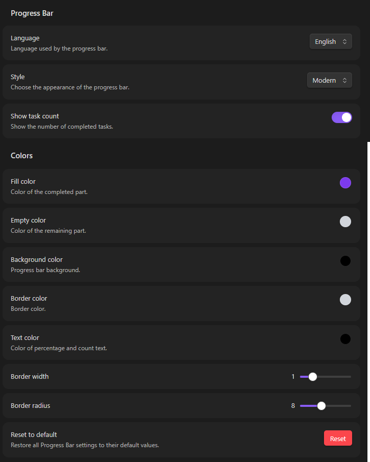

🇬🇧 **English** | [🇷🇺 Русский](README.ru.md)


# Progress Bar

An Obsidian plugin that displays customizable progress bars based on completed Markdown checkboxes.

## Features

- Calculate progress from Markdown checkboxes.
- Display progress in Reading View and Live Preview.
- Show completion percentage and task count.
- Support English and Russian.
- Modern and Classic progress bar styles.
- Customize colors, border width, and border radius.
- Enable or disable the task counter.
- Reset settings to defaults.
- Insert progress bars via the context menu or Command Palette.
- Support scoped progress bars with `[progressBar]` and `[/progressBar]`.

## Usage

### Basic Progress Bar

Add Markdown tasks to your note:

```markdown
- [x] Completed task
- [x] Another completed task
- [ ] Unfinished task
- [ ] Another unfinished task
```

Then add:

```markdown
[progressBar]
```

The plugin will calculate the progress based on all Markdown checkboxes in the note.

For example, with 2 completed tasks out of 4:

```text
50%    2 of 4 completed
```

### Scoped Progress Bar

You can limit a progress bar to a specific section of your note by using:

```markdown
[progressBar]

- [x] Task 1
- [x] Task 2
- [ ] Task 3
- [ ] Task 4

[/progressBar]
```

In this case, only the checkboxes between `[progressBar]` and `[/progressBar]` are counted.

This allows you to have multiple independent progress bars in the same note:

```markdown
# Project A

[progressBar]

- [x] Task A1
- [x] Task A2
- [ ] Task A3

[/progressBar]

# Project B

[progressBar]

- [x] Task B1
- [ ] Task B2
- [ ] Task B3
- [ ] Task B4

[/progressBar]
```

Each progress bar calculates its own progress independently.

## Customization

Progress Bar includes a customization menu in the plugin settings.



## Installation

### Community Plugins

Install **Progress Bar** from the Obsidian Community Plugins directory.

### Manual Installation

Download the latest release from GitHub and copy the following files:

```text
main.js
manifest.json
styles.css
```

into:

```text
.obsidian/plugins/progress-bar/
```

Then open Obsidian and enable **Progress Bar** in:

**Settings → Community plugins**

## Development

Clone the repository and install dependencies:

```bash
npm install
```

Run the development build:

```bash
npm run dev
```

Create a production build:

```bash
npm run build
```

## License

MIT License.

## Disclaimer

This plugin is an independent community project and is not affiliated with or endorsed by Obsidian.
